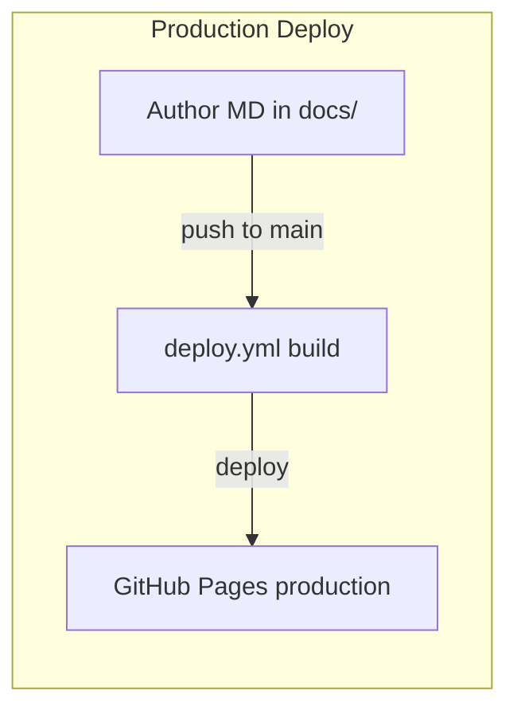
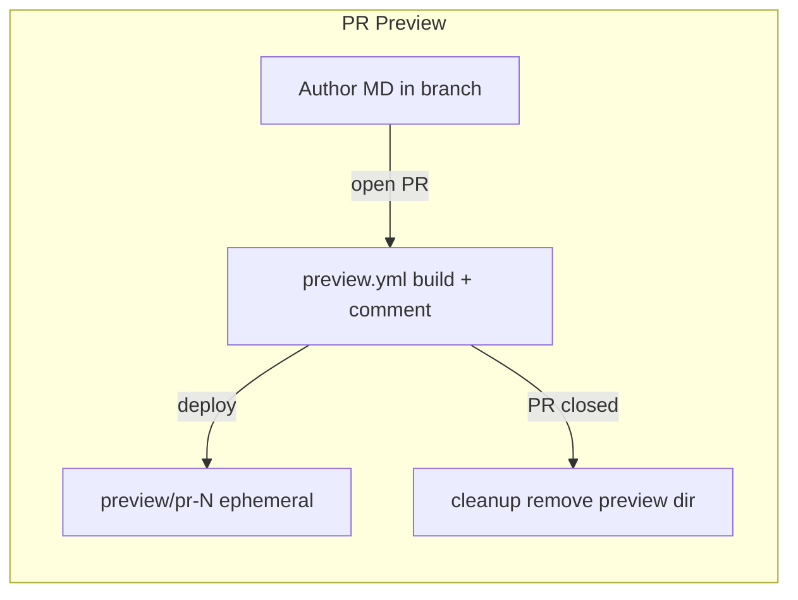

# Deployment Guide

This document covers the end-to-end setup to deploy Cerebro as a GitHub Pages site with automated publishing and PR preview deployments.

## Prerequisites

| Requirement | Details |
|-------------|---------|
| GitHub repository | Public or private (Pages available on private repos with GitHub Pro/Enterprise) |
| [uv](https://docs.astral.sh/uv/) | Fast Python package manager (replaces pip/venv) |
| Python 3.12+ | Managed automatically by uv |
| Git | For version control and pushing to remote |

## Step 1: Create the GitHub Repository

```bash
# From the Cerebro project directory
cd /path/to/Cerebro

# Initialize git (if not already done)
git init
git add .
git commit -m "Initial commit: Cerebro knowledge site"

# Create the remote repo and push
gh repo create <org>/Cerebro --private --source=. --push
```

Replace `<org>` with your GitHub organization or username.

## Step 2: Enable GitHub Pages

1. Go to **Settings > Pages** in your GitHub repository
2. Under **Source**, select **Deploy from a branch**
3. Set branch to `gh-pages` and folder to `/ (root)`
4. Click **Save**

> The `gh-pages` branch will be created automatically by the first successful deploy workflow run.

## Step 3: Configure Repository Permissions

The GitHub Actions workflows need write access to push to `gh-pages` and comment on PRs.

1. Go to **Settings > Actions > General**
2. Under **Workflow permissions**, select **Read and write permissions**
3. Check **Allow GitHub Actions to create and approve pull requests**
4. Click **Save**

## Step 4: Verify the Workflows

The repository includes two workflows in `.github/workflows/`:

### `deploy.yml` — Production Deploy

- **Triggers on**: Push to `main` that modifies `docs/**` or `mkdocs.yml`
- **What it does**: Builds the MkDocs site and deploys to the root of `gh-pages`
- **Result**: Site is live at `https://<org>.github.io/Cerebro/`

### `preview.yml` — PR Preview

- **Triggers on**: Pull requests (opened, synchronize, reopened, closed) that modify `docs/**` or `mkdocs.yml`
- **What it does**:
  - On PR open/update: builds and deploys to `gh-pages` under `/preview/pr-<number>/`
  - Posts a comment on the PR with the preview URL
  - On PR close: removes the preview directory from `gh-pages`
- **Result**: Preview at `https://<org>.github.io/Cerebro/preview/pr-<number>/`

## Step 5: Initial Deployment

Push to `main` to trigger the first build:

```bash
git push origin main
```

Monitor the workflow:

1. Go to the **Actions** tab in your repository
2. Watch the "Deploy to GitHub Pages" workflow
3. Once complete, the site is live

> The first deploy takes ~1-2 minutes. GitHub Pages may take an additional minute to propagate.

## Step 6: Verify the Live Site

Visit your site URL:

```
https://<org>.github.io/Cerebro/
```

Verify:
- [ ] Homepage loads with Snowflake branding
- [ ] Navigation works (sidebar, search)
- [ ] Search returns results
- [ ] Dark/light mode toggle works

## Step 7: Test the PR Preview Pipeline

```bash
# Create a test branch
git checkout -b docs/test-preview

# Make a change
echo "\n\nTest change for preview." >> docs/index.md

# Push and open a PR
git add .
git commit -m "Test PR preview pipeline"
git push -u origin docs/test-preview
gh pr create --title "Test preview deployment" --body "Verifying the preview pipeline works."
```

After the workflow completes:
- [ ] A bot comment appears on the PR with the preview URL
- [ ] The preview URL loads the site with your changes
- [ ] Close the PR and verify the preview is cleaned up

## Local Development

```bash
# Install uv (if not already installed)
curl -LsSf https://astral.sh/uv/install.sh | sh

# Install dependencies
uv sync

# Serve locally with hot-reload
uv run mkdocs serve

# Access at http://127.0.0.1:8000
```

## Project Structure

```
Cerebro/
├── .github/workflows/
│   ├── deploy.yml              # Production deploy on push to main
│   └── preview.yml             # PR preview deploy + cleanup
├── docs/
│   ├── index.md                # Site homepage
│   ├── assets/
│   │   └── logo.png            # Snowflake logo
│   ├── stylesheets/
│   │   └── snowflake.css       # Snowflake brand theme
│   ├── getting_started/        # Onboarding guides
│   └── Data Sources/           # Knowledge articles
├── overrides/                  # MkDocs Material template overrides
├── mkdocs.yml                  # Site configuration
└── pyproject.toml              # Python dependencies (uv)
```

## Custom Domain (Optional)

To use a custom domain instead of `<org>.github.io/Cerebro`:

1. Go to **Settings > Pages > Custom domain**
2. Enter your domain (e.g., `cerebro.yourcompany.com`)
3. Add a `CNAME` file to the repo root:
   ```
   cerebro.yourcompany.com
   ```
4. Configure DNS with your provider:
   - For apex domain: A records pointing to GitHub IPs
   - For subdomain: CNAME record pointing to `<org>.github.io`

## Troubleshooting

| Issue | Solution |
|-------|----------|
| Actions tab shows no workflows | Ensure `.github/workflows/` is committed and pushed to `main` |
| Deploy fails with permission error | Check Step 3 — workflow permissions must be read/write |
| Pages shows 404 | Verify `gh-pages` branch exists and Pages source is set correctly |
| Preview URL returns 404 | Allow a few minutes for GitHub Pages to propagate; check Actions logs |
| Build fails with `--strict` | Fix broken links or missing references shown in the build log |
| `mermaid2` plugin not found | Ensure `pyproject.toml` includes `mkdocs-mermaid2-plugin` |

## Managing Dependencies

Dependencies are defined in `pyproject.toml`. To add a new MkDocs plugin:

```bash
uv add <package-name>
```

This updates both `pyproject.toml` and the lockfile (`uv.lock`).

## Pipeline Diagram




