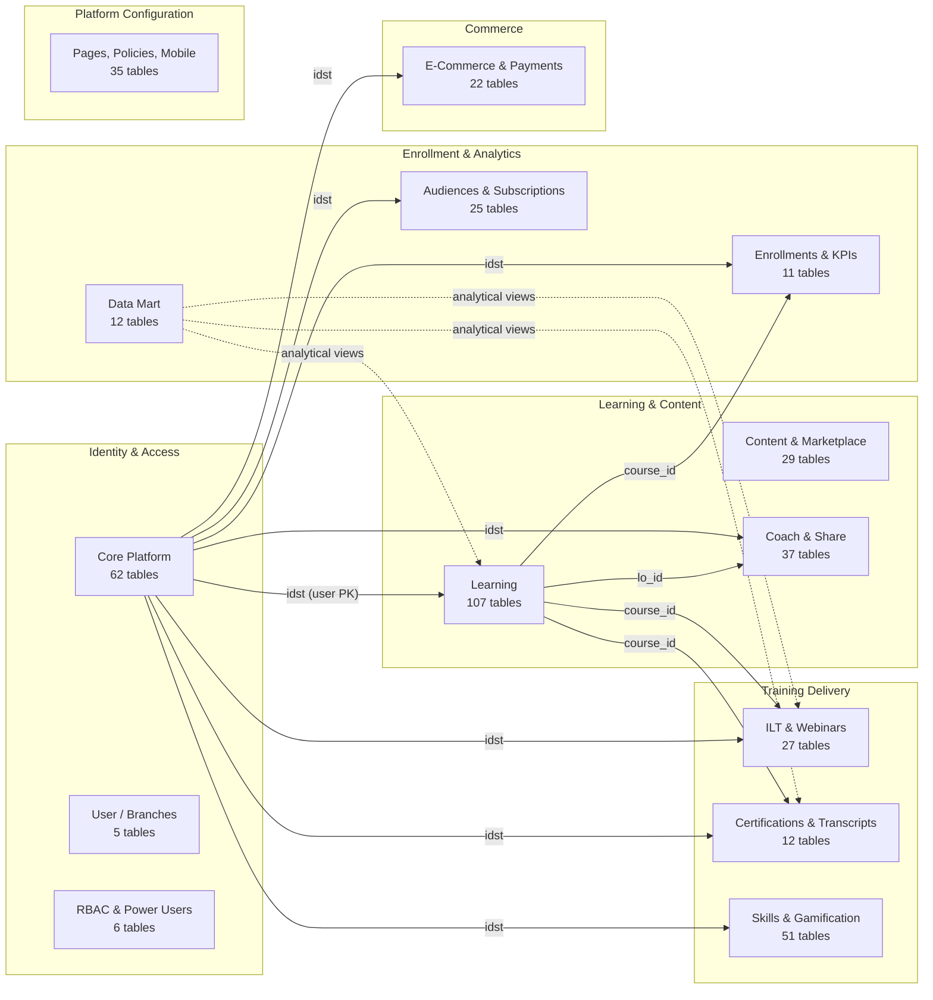

# :material-database: Docebo Learn Data
> ERD & Data Dictionary

> **Source**: Docebo Learn Data Export — February 2026  

## Database Statistics

| Metric | Count |
|--------|-------|
| Tables | 443 |
| Columns | 5,808 |
| Foreign Key Relationships | 291 |
| Domains | 50 |

## High-Level Domain Architecture

## Domain Index

| # | Domain Document | Domains Covered | Tables | Description |
|---|----------------|-----------------|--------|-------------|
| 1 | [Core Platform](core-platform.md) | Core Platform, User, Branches, Login, RBAC, Power Users, Manager Types | 72 | Users, groups, roles, org structure, notifications, settings |
| 2 | [Learning](learning.md) | Learning, LO Content, Equivalent Courses | 110 | Courses, learning paths, learning objects, tracking |
| 3 | [Enrollments](enrollments.md) | Archived Enrollments, Enrollment KPIs, Course KPIs, Group KPIs, LMS Sessions | 11 | Enrollment lifecycle, snapshots, and KPI metrics |
| 4 | [Certifications](certifications.md) | Certifications, Transcripts | 12 | Certification programs and external transcript records |
| 5 | [ILT Sessions](ilt-sessions.md) | ILT Sessions, Webinars, Attendance | 27 | Instructor-led training, virtual classrooms, attendance |
| 6 | [Coach & Share](coach-and-share.md) | Coach & Share | 37 | Social/informal learning: Q&A, channels, content sharing |
| 7 | [Skills](skills.md) | Skills, On-the-Job, Gamification | 51 | Competency mapping, observation checklists, badges/contests |
| 8 | [Content](content.md) | Content Curation, Content Marketing, Content Partners, Marketplace, LevelJump, OpenSesame | 29 | Third-party content, curation, campaigns, integrations |
| 9 | [Audiences](audiences.md) | Audiences, Communications, Subscriptions, Subscription Codes | 25 | User segmentation, messaging, subscription plans |
| 10 | [E-Commerce](ecommerce.md) | E-Commerce, Payments | 22 | Course purchases, coupons, wallets, payment gateways |
| 11 | [Data Mart](data-mart.md) | Data Mart | 12 | Pre-built analytical/reporting views (DM_* tables) |
| 12 | [Platform Config](platform-config.md) | Cookie Policy, T&C Policies, Terms & Conditions, Pages, Menu, Mobile App, Launchers, Player, Presets, Proctoring, PENS, Blacklist, Docebo | 35 | UI configuration, policies, mobile, proctoring |

## Central Entity: CORE_USER

The `CORE_USER` table (PK: `idst`) is the hub of the entire data model. Nearly all domains reference it via an `iduser` foreign key. When building analytics queries, joins to `CORE_USER` provide:

- User identity and profile fields
- Branch/group membership (via `CORE_GROUP_MEMBERS`)
- Role assignments (via `CORE_ROLE_MEMBERS`)
- Manager relationships (via `CORE_ORG_CHART_TREE`)

## Key Join Patterns

| From Domain | FK Column | To Table | To Column |
|-------------|-----------|----------|-----------|
| Learning | `iduser` | CORE_USER | `idst` |
| Coach & Share | `iduser` | CORE_USER | `idst` |
| ILT Sessions | `id_user` | CORE_USER | `idst` |
| Certifications | `id_user` | CORE_USER | `idst` |
| Skills | `iduser` | CORE_USER | `idst` |
| E-Commerce | `id_user` | CORE_USER | `idst` |
| Gamification | `id_user` | CORE_USER | `idst` |
| On-the-Job | `iduser` | CORE_USER | `idst` |
| Subscriptions | `iduser` | CORE_USER | `idst` |

---

*This documentation set was generated from the interactive ERD HTML artifact (February 2026).*
