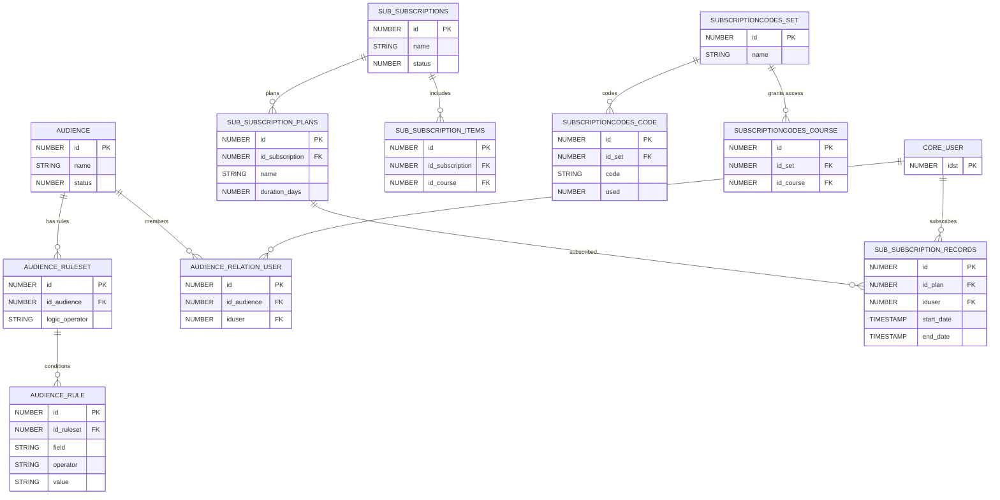

# Audiences & Subscriptions

> User segmentation (audiences), communications, subscription plans, and subscription codes for enrollment management.

These domains handle dynamic user grouping (audiences with rules), in-platform messaging, and subscription-based access to courses and learning plans.

**Domains covered**: Audiences (6), Communications (1), Subscriptions (15), Subscription Codes (3)  
**Total tables**: 25 | **Total columns**: ~248 | **Total FKs**: 19

---

## ER Diagram — Key Tables

---

## All Tables

### Audiences (6 tables)

| Table | Cols | FKs | Description |
|-------|------|-----|-------------|
| AUDIENCE | 14 | 0 | Audience definitions |
| AUDIENCE_HISTORY | 8 | 1 | Audience membership change history |
| AUDIENCE_RECALCULATOR_QUEUE | 7 | 1 | Queue for audience recalculation |
| AUDIENCE_RELATION_USER | 7 | 2 | User-to-audience membership |
| AUDIENCE_RULE | 11 | 1 | Audience rule conditions |
| AUDIENCE_RULESET | 16 | 2 | Audience rulesets (AND/OR logic) |

### Communications (1 table)

| Table | Cols | FKs | Description |
|-------|------|-----|-------------|
| COMMUNICATION_CENTER_MESSAGES | 14 | 0 | Platform communication messages |

### Subscriptions (15 tables)

| Table | Cols | FKs | Description |
|-------|------|-----|-------------|
| SUB_FIELDS | 12 | 1 | Subscription custom field definitions |
| SUB_FIELDS_DROPDOWN | 7 | 1 | Dropdown options for subscription fields |
| SUB_FIELDS_DROPDOWN_TRANSLATIONS | 6 | 0 | Translations for dropdown options |
| SUB_FIELDS_TRANSLATION | 6 | 0 | Translations for field names |
| SUB_FIELDS_VALUES | 7 | 1 | Custom field values |
| SUB_RECORD_ENROLLMENTS | 10 | 1 | Enrollments generated by subscriptions |
| SUB_RECORD_LP_ENROLLMENTS | 10 | 1 | LP enrollments from subscriptions |
| SUB_SEAT_ASSOCIATIONS | 9 | 1 | Subscription seat assignments |
| SUB_SUBSCRIPTIONS | 15 | 0 | Subscription plan definitions |
| SUB_SUBSCRIPTION_ITEMS | 7 | 1 | Items included in subscriptions |
| SUB_SUBSCRIPTION_PLANS | 12 | 0 | Subscription pricing plans |
| SUB_SUBSCRIPTION_PLANS_PRICE | 7 | 0 | Plan pricing details |
| SUB_SUBSCRIPTION_RECORDS | 14 | 1 | Active subscription records |
| SUB_SUBSCRIPTION_RECORD_ITEMS | 8 | 1 | Record-to-item mapping |
| SUB_SUBSCRIPTION_VISIBILITY | 9 | 0 | Subscription visibility rules |

### Subscription Codes (3 tables)

| Table | Cols | FKs | Description |
|-------|------|-----|-------------|
| SUBSCRIPTIONCODES_CODE | 10 | 1 | Individual codes |
| SUBSCRIPTIONCODES_COURSE | 6 | 1 | Courses accessible via code set |
| SUBSCRIPTIONCODES_SET | 7 | 0 | Code set definitions |

---

## Cross-Domain Relationships

| Source Table | FK Column | Target Domain | Target Table |
|-------------|-----------|---------------|-------------|
| AUDIENCE_RELATION_USER | iduser | [Core Platform](core-platform.md) | CORE_USER |
| AUDIENCE_RULESET | iduser (creator) | [Core Platform](core-platform.md) | CORE_USER |
| SUB_SUBSCRIPTION_RECORDS | iduser | [Core Platform](core-platform.md) | CORE_USER |
| SUB_SUBSCRIPTION_ITEMS | id_course | [Learning](learning.md) | LEARNING_COURSE |
| SUB_RECORD_ENROLLMENTS | idcourse | [Learning](learning.md) | LEARNING_COURSE |
| SUBSCRIPTIONCODES_COURSE | id_course | [Learning](learning.md) | LEARNING_COURSE |
| SUBSCRIPTIONCODES_CODE | iduser | [Core Platform](core-platform.md) | CORE_USER |

---

[Back to README](README.md)
