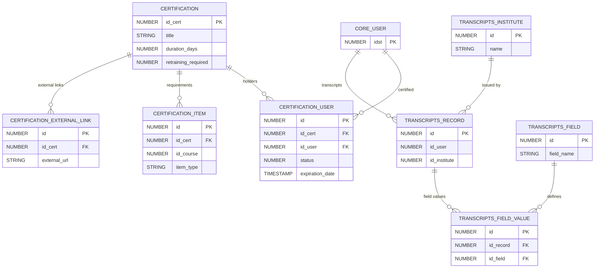

# Certifications & Transcripts

> Certification programs, user certification status, external transcript records, and educational history.

Certifications track formal qualification programs with expiration/renewal cycles. Transcripts store externally-earned education records imported into the platform.

**Domains covered**: Certifications (4), Transcripts (8)  
**Total tables**: 12 | **Total columns**: ~113 | **Total FKs**: 7

---

## ER Diagram — Key Tables

---

## All Tables

### Certifications (4 tables)

| Table | Cols | FKs | Description |
|-------|------|-----|-------------|
| CERTIFICATION | 14 | 0 | Certification program metadata |
| CERTIFICATION_EXTERNAL_LINK | 8 | 1 | External links attached to certifications |
| CERTIFICATION_ITEM | 13 | 1 | Required items (courses/LPs) for certification |
| CERTIFICATION_USER | 14 | 2 | User certification status and expiration |

### Transcripts (8 tables)

| Table | Cols | FKs | Description |
|-------|------|-----|-------------|
| TRANSCRIPTS_COURSE | 8 | 0 | Transcript course records |
| TRANSCRIPTS_FIELD | 10 | 0 | Custom transcript field definitions |
| TRANSCRIPTS_FIELD_DROPDOWN | 7 | 1 | Dropdown options for transcript fields |
| TRANSCRIPTS_FIELD_DROPDOWN_TRANSLATIONS | 6 | 0 | Translations for dropdown options |
| TRANSCRIPTS_FIELD_TRANSLATION | 6 | 0 | Translations for field names |
| TRANSCRIPTS_FIELD_VALUE | 7 | 1 | Custom field values per record |
| TRANSCRIPTS_INSTITUTE | 8 | 0 | Educational institutions |
| TRANSCRIPTS_RECORD | 12 | 1 | External transcript records |

---

## Cross-Domain Relationships

| Source Table | FK Column | Target Domain | Target Table |
|-------------|-----------|---------------|-------------|
| CERTIFICATION_USER | id_user | [Core Platform](core-platform.md) | CORE_USER |
| CERTIFICATION_ITEM | id_course | [Learning](learning.md) | LEARNING_COURSE |
| TRANSCRIPTS_RECORD | id_user | [Core Platform](core-platform.md) | CORE_USER |

---

[Back to README](README.md)
