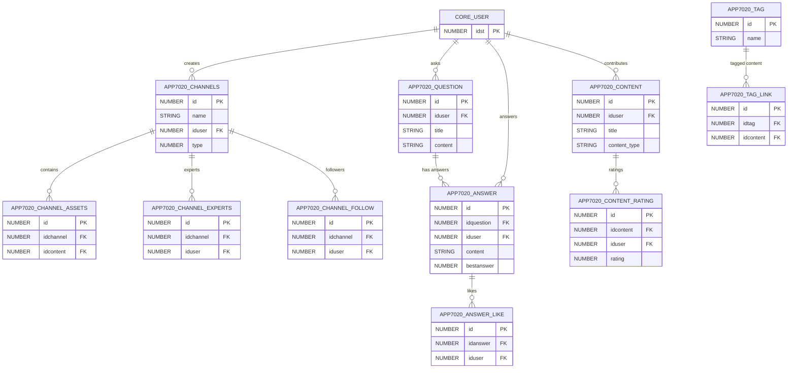

# Coach & Share

> Social/informal learning: Q&A forums, knowledge channels, expert networks, content sharing, playlists, and engagement metrics.

The Coach & Share module (APP7020_*) enables peer-to-peer learning through questions, answers, expert-curated channels, and user-generated content. All tables use the `APP7020_` prefix.

**Domains covered**: Coach & Share (37)  
**Total tables**: 37 | **Total columns**: ~349 | **Total FKs**: 63

---

## ER Diagram — Key Tables

---

## All Tables (37)

| Table | Cols | FKs | Description |
|-------|------|-----|-------------|
| APP7020_ANSWER | 11 | 3 | Answers to questions (with best answer flag) |
| APP7020_ANSWER_LIKE | 8 | 2 | Answer like/dislike counts |
| APP7020_ASSET_DISMISS_HISTORY | 9 | 1 | Hidden assets on user dashboard |
| APP7020_CHANNELS | 16 | 1 | Knowledge channels |
| APP7020_CHANNEL_ASSETS | 7 | 2 | Assets within channels |
| APP7020_CHANNEL_EXPERTS | 7 | 2 | Channel expert assignments |
| APP7020_CHANNEL_FOLLOW | 7 | 2 | Channel followers |
| APP7020_CHANNEL_QUESTIONS | 6 | 2 | Questions linked to channels |
| APP7020_CHANNEL_TRANSLATION | 8 | 1 | Channel translations |
| APP7020_CHANNEL_VISIBILITY | 8 | 1 | Channel visibility rules |
| APP7020_COMMENT_LIKE | 8 | 2 | Comment like/dislike counts |
| APP7020_CONTENT | 17 | 1 | User-generated content |
| APP7020_CONTENT_HISTORY | 10 | 2 | Content edit history |
| APP7020_CONTENT_PLAYLISTS | 8 | 2 | Content playlists |
| APP7020_CONTENT_PUBLISHED | 9 | 2 | Published content records |
| APP7020_CONTENT_RATING | 7 | 2 | Content ratings |
| APP7020_CONTENT_REVIEWS | 10 | 2 | Content reviews |
| APP7020_CONTENT_THUMBS | 7 | 2 | Content thumbs up/down |
| APP7020_CUSTOM_CONTENT_SETTINGS | 8 | 0 | Custom content type settings |
| APP7020_EXPERTS | 7 | 2 | Expert users |
| APP7020_EXTERNAL_CONTENT_BLACKLIST | 7 | 1 | Blocked external content |
| APP7020_EXTERNAL_CONTENT_EXCLUSIONS | 6 | 1 | External content exclusion rules |
| APP7020_EXTERNAL_CONTENT_HISTORY | 9 | 1 | External content access history |
| APP7020_IGNORE_LIST | 6 | 2 | User ignore/block list |
| APP7020_INVITATIONS | 10 | 2 | Channel invitations |
| APP7020_INVITE_WATCH | 6 | 2 | Invitation watch status |
| APP7020_MENTION | 8 | 2 | User mentions |
| APP7020_PERSONAL_CHANNELS_SETTINGS | 6 | 1 | Personal channel preferences |
| APP7020_QUESTION | 12 | 1 | Questions posted by users |
| APP7020_QUESTIONS_TAGS | 6 | 2 | Question tag associations |
| APP7020_QUESTION_FOLLOW | 7 | 2 | Question followers |
| APP7020_QUESTION_HISTORY | 9 | 2 | Question edit history |
| APP7020_SPENT_TIME_HISTORY | 8 | 2 | Time spent on content |
| APP7020_TAG | 6 | 0 | Tags/topics |
| APP7020_TAGS_LO | 7 | 2 | Tags linked to learning objects |
| APP7020_TAG_LINK | 7 | 2 | Tag-to-content associations |
| APP7020_TOOLTIPS | 6 | 0 | UI tooltip definitions |

---

## Cross-Domain Relationships

| Source Table | FK Column | Target Domain | Target Table |
|-------------|-----------|---------------|-------------|
| APP7020_* (28 tables) | iduser | [Core Platform](core-platform.md) | CORE_USER |
| APP7020_TAGS_LO | idlo | [Learning](learning.md) | LEARNING_ORGANIZATION |
| Content Marketing | idchannel | Coach & Share | APP7020_CHANNELS |
| Skills | idchannel | Coach & Share | APP7020_CHANNELS |

---

[Back to README](README.md)
