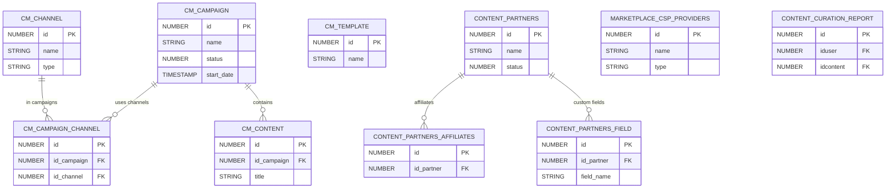

# Content & Marketplace

> Third-party content integrations, content curation, marketing campaigns, content partners, and marketplace provider connections.

This document covers content sourcing and distribution: curation (dismiss/report), marketing campaigns, partner management, and external marketplace integrations (Go1, LinkedIn Learning, Skilla, OpenSesame, LevelJump).

**Domains covered**: Content Curation (2), Content Marketing (5), Content Partners (8), Marketplace (11), LevelJump (2), OpenSesame (1)  
**Total tables**: 29 | **Total columns**: ~301 | **Total FKs**: 14

---

## ER Diagram — Key Tables

---

## All Tables

### Content Curation (2 tables)

| Table | Cols | FKs | Description |
|-------|------|-----|-------------|
| CONTENT_CURATION_DISMISSION | 9 | 0 | Dismissed/hidden curated content |
| CONTENT_CURATION_REPORT | 9 | 0 | Reported curated content |

### Content Marketing (5 tables)

| Table | Cols | FKs | Description |
|-------|------|-----|-------------|
| CM_CAMPAIGN | 16 | 1 | Marketing campaign definitions |
| CM_CAMPAIGN_CHANNEL | 7 | 2 | Campaign-to-channel mapping |
| CM_CHANNEL | 10 | 1 | Distribution channels |
| CM_CONTENT | 13 | 2 | Campaign content items |
| CM_TEMPLATE | 9 | 1 | Campaign templates |

### Content Partners (8 tables)

| Table | Cols | FKs | Description |
|-------|------|-----|-------------|
| CONTENT_PARTNERS | 16 | 1 | Partner organization definitions |
| CONTENT_PARTNERS_AFFILIATES | 9 | 1 | Partner affiliate relationships |
| CONTENT_PARTNERS_FIELD | 10 | 1 | Custom fields for partners |
| CONTENT_PARTNERS_FIELD_DROPDOWN | 7 | 1 | Dropdown options for partner fields |
| CONTENT_PARTNERS_FIELD_DROPDOWN_TRANSLATIONS | 6 | 0 | Translations for dropdown options |
| CONTENT_PARTNERS_FIELD_TRANSLATION | 6 | 0 | Translations for field names |
| CONTENT_PARTNERS_FIELD_VALUE | 7 | 1 | Custom field values per partner |
| CONTENT_PARTNERS_REFERRAL_LOG | 23 | 1 | Partner referral tracking |

### Marketplace (11 tables)

| Table | Cols | FKs | Description |
|-------|------|-----|-------------|
| MARKETPLACE_CSP_PROVIDERS | 13 | 1 | CSP (Content Service Provider) integrations |
| MARKETPLACE_CSP_VISIBILITY | 8 | 0 | CSP visibility rules |
| MARKETPLACE_GO1_ACCOUNT_HISTORY | 11 | 0 | Go1 account change history |
| MARKETPLACE_GO1_COURSES_IMPORT_SYNC | 10 | 0 | Go1 course import sync status |
| MARKETPLACE_GO1_COURSES_STATISTICS | 8 | 0 | Go1 course usage statistics |
| MARKETPLACE_GO1_DECOMMISSIONING | 9 | 0 | Go1 decommissioning records |
| MARKETPLACE_GO1_INDUSTRY | 7 | 0 | Go1 industry categories |
| MARKETPLACE_GO1_TERMS_CONDITIONS_FULLTEXT | 6 | 0 | Go1 T&C full text |
| MARKETPLACE_GO1_TERMS_CONDITIONS_MAIN | 9 | 0 | Go1 T&C metadata |
| MARKETPLACE_LINKEDIN_LEARNING_TENANTS | 12 | 0 | LinkedIn Learning tenant config |
| MARKETPLACE_SKILLA_TENANTS | 12 | 0 | Skilla tenant configuration |

### LevelJump (2 tables)

| Table | Cols | FKs | Description |
|-------|------|-----|-------------|
| LEVELJUMP_ADDITIONAL_FIELDS | 14 | 0 | LevelJump custom fields |
| LEVELJUMP_SYNC_SETTINGS | 15 | 0 | LevelJump sync configuration |

### OpenSesame (1 table)

| Table | Cols | FKs | Description |
|-------|------|-----|-------------|
| OPENSESAME_TENANTS | 10 | 0 | OpenSesame tenant configuration |

---

## Cross-Domain Relationships

| Source Table | FK Column | Target Domain | Target Table |
|-------------|-----------|---------------|-------------|
| CM_CAMPAIGN_CHANNEL | id_channel | [Coach & Share](coach-and-share.md) | APP7020_CHANNELS |
| CM_CONTENT | idcourse | [Learning](learning.md) | LEARNING_COURSE |
| CONTENT_PARTNERS_* | iduser | [Core Platform](core-platform.md) | CORE_USER |
| MARKETPLACE_CSP_PROVIDERS | id_user | [Core Platform](core-platform.md) | CORE_USER |

---

[Back to README](README.md)
