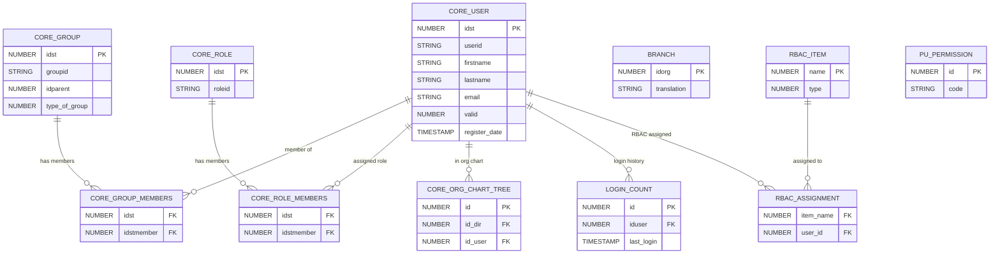

# Core Platform

> Users, groups, roles, org structure, notifications, platform settings, and access control.

This domain is the **foundation** of the Docebo data model. The `CORE_USER` table (PK: `idst`) is referenced by virtually every other domain.

**Domains covered**: Core Platform (62), User (3), Branches (1), Login (1), RBAC (4), Power Users (2), Manager Types (1)  
**Total tables**: 72 | **Total columns**: ~930 | **Total FKs**: ~44

---

## ER Diagram — Key Tables

---

## All Tables

### Core Platform (62 tables)

| Table | Cols | FKs | Description |
|-------|------|-----|-------------|
| CORE_ADMIN_COURSE | 6 | 0 | Relationship between power user and learning item |
| CORE_ADMIN_TMREPO_FOLDER | 10 | 3 | Training material repository folder admin |
| CORE_ADMIN_TREE | 6 | 0 | Relationship between power users and user groups |
| CORE_ASSET | 13 | 2 | Uploaded assets metadata (S3) |
| CORE_COUNTRY | 8 | 0 | Platform countries code |
| CORE_DELETED_USER | 20 | 0 | User soft deletion table |
| CORE_ENROLL_LOG | 7 | 1 | Performed enrollment rules log |
| CORE_ENROLL_LOG_ITEM | 9 | 1 | Enrolled entities performed by enrollment rules |
| CORE_ENROLL_RULE | 17 | 2 | Enrollment rules metadata |
| CORE_ENROLL_RULE_ITEM | 8 | 1 | Enroll rules configuration |
| CORE_GROUP | 15 | 1 | Groups metadata |
| CORE_GROUP_ASSIGN_RULES | 8 | 1 | User group assignment rules |
| CORE_GROUP_FIELDS | 9 | 1 | Branch additional fields |
| CORE_GROUP_MEMBERS | 7 | 1 | Relationship between users and groups/branches |
| CORE_HTTPS | 29 | 1 | HTTPS certificates list |
| CORE_JOB | 28 | 1 | Internal scheduler jobs |
| CORE_JOB_ARCHIVE | 31 | 0 | Archived scheduler jobs |
| CORE_JOB_LOG | 10 | 1 | List of performed jobs |
| CORE_LANG_LANGUAGE | 10 | 0 | Supported languages metadata |
| CORE_LANG_TEXT | 8 | 0 | Custom language keys override |
| CORE_LANG_TRANSLATION | 9 | 0 | Custom translations for supported languages |
| CORE_MULTIDOMAIN | 194 | 0 | Multidomain instances metadata |
| CORE_MULTIDOMAIN_HEADER_FOOTER | 9 | 0 | Custom HTML header/footer |
| CORE_MULTIDOMAIN_SIGNIN_TEXT | 8 | 1 | Custom signin page HTML |
| CORE_MULTIDOMAIN_WEBPAGE | 7 | 2 | Webpage-to-multidomain relationship |
| CORE_NEWSLETTER | 13 | 0 | Sent newsletters metadata |
| CORE_NEWSLETTER_SENDTO | 8 | 0 | Newsletter delivery statuses |
| CORE_NOTIFICATION | 23 | 1 | Notifications metadata |
| CORE_NOTIFICATION_ASSOC | 7 | 1 | Notification-content relationship |
| CORE_NOTIFICATION_RECIPIENTS_BATCH | 14 | 0 | Notification batch recipients |
| CORE_NOTIFICATION_TRANSLATION | 9 | 0 | Notification translations |
| CORE_NOTIFICATION_TRANSPORT | 10 | 0 | Notification transport channels |
| CORE_NOTIFICATION_TRANSPORT_ACTIVATION | 7 | 0 | Transport activation settings |
| CORE_NOTIFICATION_USER_FILTER | 7 | 1 | User notification filters |
| CORE_ORG_CHART | 11 | 1 | Organization chart metadata |
| CORE_ORG_CHART_TREE | 11 | 1 | Org chart tree hierarchy |
| CORE_PLUGIN | 5 | 0 | Installed plugins list |
| CORE_PWD_RECOVER | 9 | 0 | Password recovery tokens |
| CORE_ROLE | 8 | 0 | Roles metadata |
| CORE_ROLE_MEMBERS | 7 | 1 | User-to-role assignments |
| CORE_SETTING | 7 | 0 | Platform settings (key-value) |
| CORE_SETTING_GROUP | 7 | 0 | Settings grouped by module |
| CORE_SETTING_LARGE_VOLUME | 6 | 0 | Large volume settings |
| CORE_SETTING_TINCAN_URL | 6 | 0 | xAPI (Tin Can) URL settings |
| CORE_SETTING_USER | 7 | 0 | Per-user settings |
| CORE_SETTING_WHITELIST | 5 | 0 | Setting value whitelist |
| CORE_ST | 12 | 0 | Session tokens |
| CORE_TIMEZONE_TRANSLATE | 7 | 0 | Timezone translations |
| CORE_USER | 37 | 0 | **Central user table** — all domains reference this |
| CORE_USER_2FA_SECRETS | 8 | 0 | Two-factor authentication secrets |
| CORE_USER_BILLING | 15 | 0 | User billing information |
| CORE_USER_FIELD | 17 | 0 | Custom user field definitions |
| CORE_USER_FIELD_DROPDOWN | 9 | 0 | Dropdown options for custom fields |
| CORE_USER_FIELD_DROPDOWN_TRANSLATIONS | 7 | 0 | Translations for dropdown options |
| CORE_USER_FIELD_TRANSLATION | 7 | 0 | Translations for custom field labels |
| CORE_USER_FIELD_VALUE | 9 | 1 | Custom field values per user |
| CORE_USER_PU | 8 | 1 | Power user assignments |
| CORE_USER_PU_COURSE | 7 | 0 | Power user course permissions |
| CORE_USER_PU_COURSEPATH | 7 | 0 | Power user learning path permissions |
| CORE_USER_PU_LOCATION | 7 | 0 | Power user location permissions |
| CORE_USER_TEMP | 30 | 0 | Temporary user records (pre-activation) |
| CORE_USER_TOKEN_IMPERSONATED | 10 | 0 | Impersonation tokens |

### User (3 tables)

| Table | Cols | FKs | Description |
|-------|------|-----|-------------|
| USER_BRANCH | 3 | 0 | User-to-branch snapshot |
| USER_GROUP | 3 | 0 | User-to-group snapshot |
| USER_SNAPSHOT_KPI | 5 | 0 | User count KPI snapshots |

### Branches (1 table)

| Table | Cols | FKs | Description |
|-------|------|-----|-------------|
| BRANCH | 6 | 0 | Organizational branch definitions |

### Login (1 table)

| Table | Cols | FKs | Description |
|-------|------|-----|-------------|
| LOGIN_COUNT | 7 | 1 | User login count and last login timestamp |

### RBAC (4 tables)

| Table | Cols | FKs | Description |
|-------|------|-----|-------------|
| RBAC_ASSIGNMENT | 6 | 1 | Role-based access control assignments |
| RBAC_ITEM | 9 | 0 | RBAC permission items |
| RBAC_ITEM_CHILD | 7 | 2 | Parent-child permission hierarchy |
| RBAC_RULE | 9 | 1 | RBAC rules definitions |

### Power Users (2 tables)

| Table | Cols | FKs | Description |
|-------|------|-----|-------------|
| PU_PERMISSION | 12 | 1 | Power user permission definitions |
| PU_PERMISSION_DEPENDENCY | 6 | 1 | Permission dependency graph |

### Manager Types (1 table)

| Table | Cols | FKs | Description |
|-------|------|-----|-------------|
| MANAGER_TYPE | 7 | 0 | Manager type definitions (direct, dotted-line, etc.) |

---

## Cross-Domain Relationships

| Source Table | FK Column | Target Domain | Target Table |
|-------------|-----------|---------------|-------------|
| CORE_ENROLL_RULE | idcourse | [Learning](learning.md) | LEARNING_COURSE |
| CORE_MULTIDOMAIN_WEBPAGE | idpage | [Platform Config](platform-config.md) | PAGE |
| CORE_ASSET | * | Referenced by | [Learning](learning.md), [Coach & Share](coach-and-share.md) |
| LOGIN_COUNT | iduser | Core Platform | CORE_USER |

Most domains contain FKs **to** CORE_USER.idst — see individual domain docs for specifics.

---

[Back to README](README.md)
