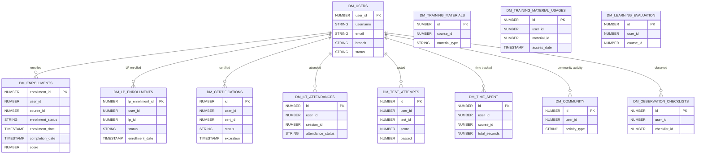

# Data Mart

> Pre-built analytical/reporting views covering enrollments, certifications, ILT, tests, time spent, community activity, and more.

The Data Mart (DM_*) tables are **denormalized reporting views** designed for direct consumption by BI tools and dashboards. They flatten the normalized transactional schema into wide, query-friendly tables with pre-joined dimensions.

**Domains covered**: Data Mart (12)  
**Total tables**: 12 | **Total columns**: ~726 | **Total FKs**: 0

---

## ER Diagram — Logical Relationships

---

## All Tables (12)

| Table | Cols | FKs | Description |
|-------|------|-----|-------------|
| DM_CERTIFICATIONS | 44 | 0 | Flattened certification status per user |
| DM_COMMUNITY | 42 | 0 | Coach & Share / community activity metrics |
| DM_ENROLLMENTS | 93 | 0 | **Primary enrollment reporting table** — fully denormalized |
| DM_ILT_ATTENDANCES | 52 | 0 | ILT/webinar attendance with session details |
| DM_LEARNING_EVALUATION | 38 | 0 | Learning evaluation/feedback data |
| DM_LP_ENROLLMENTS | 59 | 0 | Learning plan enrollment reporting |
| DM_OBSERVATION_CHECKLISTS | 65 | 0 | OTJ observation checklist results |
| DM_TEST_ATTEMPTS | 48 | 0 | Test attempt details with scores |
| DM_TIME_SPENT | 36 | 0 | Time spent per user/course aggregation |
| DM_TRAINING_MATERIALS | 64 | 0 | Training material metadata |
| DM_TRAINING_MATERIAL_USAGES | 57 | 0 | Material usage tracking per user |
| DM_USERS | 128 | 0 | **User dimension table** — all user fields flattened |

---

## Usage Notes

- **No declared FKs**: DM_* tables are denormalized — they embed dimension data directly rather than joining via foreign keys.
- **Best for reporting**: Use these tables as the primary source for dashboards and analytics. They avoid complex multi-table joins.
- **DM_ENROLLMENTS** (93 columns) is the most comprehensive single table for enrollment analytics.
- **DM_USERS** (128 columns) includes all custom user fields, branch hierarchy, and computed attributes.
- **Refresh frequency**: These are typically refreshed on a scheduled basis (not real-time).

## Mapping to Source Domains

| DM Table | Source Domains |
|----------|---------------|
| DM_ENROLLMENTS | [Learning](learning.md), [Core Platform](core-platform.md) |
| DM_LP_ENROLLMENTS | [Learning](learning.md) |
| DM_USERS | [Core Platform](core-platform.md) |
| DM_CERTIFICATIONS | [Certifications](certifications.md) |
| DM_ILT_ATTENDANCES | [ILT Sessions](ilt-sessions.md) |
| DM_TEST_ATTEMPTS | [Learning](learning.md) |
| DM_TIME_SPENT | [Learning](learning.md) |
| DM_TRAINING_MATERIALS | [Learning](learning.md) |
| DM_TRAINING_MATERIAL_USAGES | [Learning](learning.md) |
| DM_COMMUNITY | [Coach & Share](coach-and-share.md) |
| DM_OBSERVATION_CHECKLISTS | [Skills](skills.md) |
| DM_LEARNING_EVALUATION | [Learning](learning.md) |

---

[Back to README](README.md)
