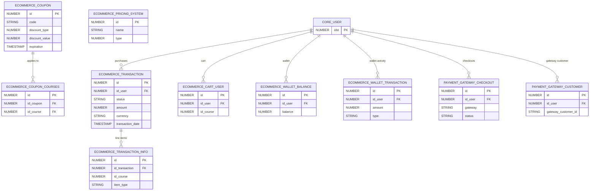

# E-Commerce & Payments

> Course purchasing, coupons, pricing systems, cart management, wallets, transactions, and payment gateway integrations.

These tables power the commercial side of Docebo: purchasing courses/LPs, coupon management, multi-currency support, digital wallets, and payment processing through external gateways.

**Domains covered**: E-Commerce (20), Payments (2)  
**Total tables**: 22 | **Total columns**: ~233 | **Total FKs**: 11

---

## ER Diagram — Key Tables

---

## All Tables

### E-Commerce (20 tables)

| Table | Cols | FKs | Description |
|-------|------|-----|-------------|
| ECOMMERCE_ACTIVE_CURRENCY | 6 | 0 | Active currencies in platform |
| ECOMMERCE_ACTIVE_CURRENCY_DOMAIN | 6 | 0 | Active currencies per domain |
| ECOMMERCE_CART_SYSTEM | 6 | 0 | System cart configuration |
| ECOMMERCE_CART_USER | 10 | 1 | User shopping cart items |
| ECOMMERCE_COUPON | 22 | 0 | Coupon definitions |
| ECOMMERCE_COUPON_COURSES | 6 | 1 | Coupon-to-course applicability |
| ECOMMERCE_COUPON_PATHS | 6 | 0 | Coupon-to-LP applicability |
| ECOMMERCE_CURRENCIES | 7 | 0 | Available currencies |
| ECOMMERCE_CUSTOM_CART_ACTION | 7 | 0 | Custom cart actions |
| ECOMMERCE_CUSTOM_PRICING_SYSTEM_ACTION | 7 | 0 | Custom pricing actions |
| ECOMMERCE_EXTERNAL_TRANSACTION | 14 | 1 | External payment transactions |
| ECOMMERCE_PRICING_SYSTEM | 11 | 0 | Pricing system definitions |
| ECOMMERCE_SETTINGS | 12 | 0 | E-commerce global settings |
| ECOMMERCE_SETTINGS_MULTIDOMAIN | 9 | 0 | Per-domain e-commerce settings |
| ECOMMERCE_TRANSACTION | 28 | 2 | **Transaction records** |
| ECOMMERCE_TRANSACTION_INFO | 16 | 2 | Transaction line items |
| ECOMMERCE_WALLET_BALANCE | 7 | 1 | User wallet balances |
| ECOMMERCE_WALLET_TRANSACTION | 14 | 1 | Wallet transaction history |
| ECOMMERCE_WALLET_TRANSACTION_BENEFICIARY | 8 | 0 | Wallet transaction beneficiaries |
| ECOMMERCE_WALLET_TRANSACTION_ITEM | 12 | 0 | Wallet transaction line items |

### Payments (2 tables)

| Table | Cols | FKs | Description |
|-------|------|-----|-------------|
| PAYMENT_GATEWAY_CHECKOUT | 13 | 1 | Payment gateway checkout sessions |
| PAYMENT_GATEWAY_CUSTOMER | 8 | 1 | Payment gateway customer records |

---

## Cross-Domain Relationships

| Source Table | FK Column | Target Domain | Target Table |
|-------------|-----------|---------------|-------------|
| ECOMMERCE_TRANSACTION | id_user | [Core Platform](core-platform.md) | CORE_USER |
| ECOMMERCE_CART_USER | id_user | [Core Platform](core-platform.md) | CORE_USER |
| ECOMMERCE_COUPON_COURSES | id_course | [Learning](learning.md) | LEARNING_COURSE |
| ECOMMERCE_TRANSACTION_INFO | id_course | [Learning](learning.md) | LEARNING_COURSE |
| PAYMENT_GATEWAY_CHECKOUT | id_user | [Core Platform](core-platform.md) | CORE_USER |
| PAYMENT_GATEWAY_CUSTOMER | id_user | [Core Platform](core-platform.md) | CORE_USER |

---

[Back to README](README.md)
