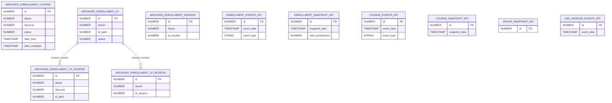

# Enrollments

> Archived enrollment history, enrollment/course/group KPI snapshots, and LMS session events.

These tables capture enrollment lifecycle events and pre-computed KPI metrics used for dashboards and reporting.

**Domains covered**: Archived Enrollments (5), Enrollment KPIs (2), Course KPIs (2), Group KPIs (1), LMS Sessions (1)  
**Total tables**: 11 | **Total columns**: ~172 | **Total FKs**: 0

---

## ER Diagram — Key Tables

---

## All Tables

### Archived Enrollments (5 tables)

| Table | Cols | FKs | Description |
|-------|------|-----|-------------|
| ARCHIVED_ENROLLMENT_COURSE | 28 | 0 | Archived course enrollment records |
| ARCHIVED_ENROLLMENT_LP | 22 | 0 | Archived learning plan enrollment records |
| ARCHIVED_ENROLLMENT_LP_COURSE | 30 | 0 | Archived LP-course enrollment details |
| ARCHIVED_ENROLLMENT_LP_SESSION | 26 | 0 | Archived LP-session enrollment details |
| ARCHIVED_ENROLLMENT_SESSION | 24 | 0 | Archived session enrollment records |

### Enrollment KPIs (2 tables)

| Table | Cols | FKs | Description |
|-------|------|-----|-------------|
| ENROLLMENT_EVENTS_KPI | 10 | 0 | Enrollment event metrics (enroll, complete, etc.) |
| ENROLLMENT_SNAPSHOT_KPI | 7 | 0 | Point-in-time enrollment count snapshots |

### Course KPIs (2 tables)

| Table | Cols | FKs | Description |
|-------|------|-----|-------------|
| COURSE_EVENTS_KPI | 8 | 0 | Course event metrics |
| COURSE_SNAPSHOT_KPI | 6 | 0 | Point-in-time course count snapshots |

### Group KPIs (1 table)

| Table | Cols | FKs | Description |
|-------|------|-----|-------------|
| GROUP_SNAPSHOT_KPI | 3 | 0 | Group membership count snapshots |

### LMS Sessions (1 table)

| Table | Cols | FKs | Description |
|-------|------|-----|-------------|
| LMS_SESSION_EVENTS_KPI | 8 | 0 | LMS session event metrics |

---

## Cross-Domain Relationships

| Relationship | Target Domain |
|-------------|---------------|
| Archived enrollments contain `iduser` column (logical FK) | [Core Platform](core-platform.md) |
| Archived enrollments contain `idcourse` column (logical FK) | [Learning](learning.md) |
| Archived enrollments contain `id_path` column (logical FK) | [Learning](learning.md) |
| Archived sessions reference `id_session` (logical FK) | [ILT Sessions](ilt-sessions.md) |

Note: These tables have 0 declared FKs but contain logical references via column naming conventions.

---

[Back to README](README.md)
