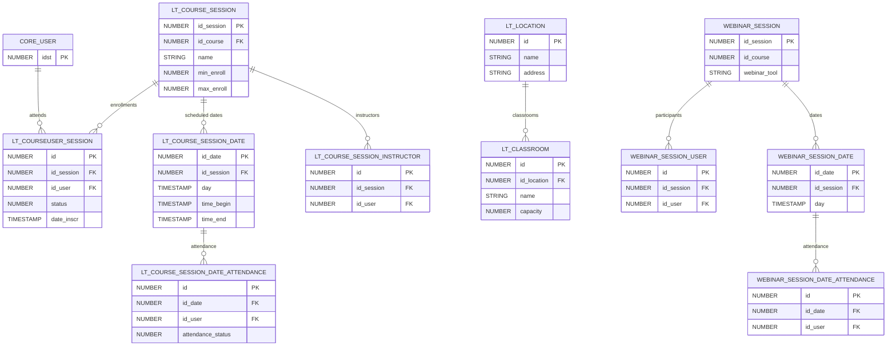

# ILT Sessions & Webinars

> Instructor-Led Training sessions, virtual classrooms (webinars), locations, scheduling, and attendance tracking.

These tables manage the logistics of live/synchronous training: classrooms, session dates, instructor assignments, attendance records, and webinar tool integrations.

**Domains covered**: ILT Sessions (14), Webinars (12), Attendance (1)  
**Total tables**: 27 | **Total columns**: ~350 | **Total FKs**: 8

---

## ER Diagram — Key Tables

---

## All Tables

### ILT Sessions (14 tables)

| Table | Cols | FKs | Description |
|-------|------|-----|-------------|
| LT_CLASSROOM | 13 | 0 | Physical/virtual classroom definitions |
| LT_COURSEUSER_SESSION | 28 | 1 | User enrollment in ILT sessions |
| LT_COURSE_SESSION | 35 | 1 | ILT session metadata |
| LT_COURSE_SESSION_DATE | 13 | 0 | Session date/time schedule |
| LT_COURSE_SESSION_DATE_ATTENDANCE | 9 | 0 | Per-date attendance records |
| LT_COURSE_SESSION_DATE_CALENDAR_RSVP | 7 | 0 | Calendar RSVP responses |
| LT_COURSE_SESSION_DATE_CALENDAR_SYNC | 8 | 0 | Calendar sync status |
| LT_COURSE_SESSION_DATE_RECORDING | 9 | 0 | Session date recordings |
| LT_COURSE_SESSION_DATE_WEBINAR_SETTING | 10 | 0 | Webinar settings per date |
| LT_COURSE_SESSION_FIELD_VALUE | 7 | 0 | Session custom field values |
| LT_COURSE_SESSION_INSTRUCTOR | 8 | 1 | Session instructor assignments |
| LT_COURSE_SESSION_SHOPIFY_VARIANT | 7 | 0 | Shopify variant mapping |
| LT_LOCATION | 16 | 0 | Physical training locations |
| LT_LOCATION_PHOTO | 8 | 0 | Location photos |

### Webinars (12 tables)

| Table | Cols | FKs | Description |
|-------|------|-----|-------------|
| WEBINAR_ILT_ADDITIONAL_FIELDS_MIGRATION | 7 | 0 | ILT migration fields |
| WEBINAR_ILT_EVENT_MAP | 9 | 0 | ILT-to-webinar event mapping |
| WEBINAR_ILT_MIGRATION_RESULT | 9 | 0 | Migration results |
| WEBINAR_ILT_SESSION_MAP | 8 | 0 | ILT-to-webinar session mapping |
| WEBINAR_SESSION | 21 | 2 | Webinar session metadata |
| WEBINAR_SESSION_DATE | 12 | 0 | Webinar scheduled dates |
| WEBINAR_SESSION_DATE_ATTENDANCE | 9 | 0 | Webinar date attendance |
| WEBINAR_SESSION_DATE_RECORDING | 9 | 0 | Webinar recordings |
| WEBINAR_SESSION_FIELD_VALUE | 7 | 0 | Custom field values for webinar sessions |
| WEBINAR_SESSION_SHOPIFY_VARIANT | 7 | 0 | Shopify variant mapping |
| WEBINAR_SESSION_USER | 22 | 2 | Webinar session user enrollment |
| WEBINAR_TOOL_ACCOUNT | 17 | 1 | Webinar tool account configuration |

### Attendance (1 table)

| Table | Cols | FKs | Description |
|-------|------|-----|-------------|
| ATTENDANCE_SHEET_FIELDS_MAIN | 14 | 0 | Attendance sheet field definitions |

---

## Cross-Domain Relationships

| Source Table | FK Column | Target Domain | Target Table |
|-------------|-----------|---------------|-------------|
| LT_COURSEUSER_SESSION | id_user | [Core Platform](core-platform.md) | CORE_USER |
| LT_COURSE_SESSION | id_course | [Learning](learning.md) | LEARNING_COURSE |
| LT_COURSE_SESSION_INSTRUCTOR | id_user | [Core Platform](core-platform.md) | CORE_USER |
| WEBINAR_SESSION | id_course | [Learning](learning.md) | LEARNING_COURSE |
| WEBINAR_SESSION_USER | id_user | [Core Platform](core-platform.md) | CORE_USER |
| WEBINAR_TOOL_ACCOUNT | id_user | [Core Platform](core-platform.md) | CORE_USER |

---

[Back to README](README.md)
