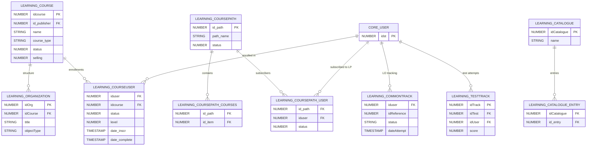

# Learning

> Courses, learning paths, learning objects (SCORM, AICC, xAPI, tests, surveys, videos), enrollment tracking, and the central repository.

This is the **largest domain** (107 tables) and represents all course/content structure, user enrollments, and learning object tracking. The key hub tables are `LEARNING_COURSE` and `LEARNING_COURSEUSER`.

**Domains covered**: Learning (107), LO Content (2), Equivalent Courses (1)  
**Total tables**: 110 | **Total columns**: ~1,504 | **Total FKs**: ~63

---

## ER Diagram — Key Tables

---

## All Tables

### Learning (107 tables)

| Table | Cols | FKs | Description |
|-------|------|-----|-------------|
| LEARNING_AICC_ITEM | 29 | 0 | AICC objects metadata |
| LEARNING_AICC_ITEM_TRACK | 24 | 1 | Tracking of AICC items user actions |
| LEARNING_AICC_PACKAGE | 20 | 0 | AICC archive description/metadata |
| LEARNING_AICC_PACKAGE_TRACK | 9 | 1 | Tracking of AICC packages user actions |
| LEARNING_AICC_SESSION | 14 | 1 | AICC object sessions |
| LEARNING_AUTHORING | 20 | 0 | Files to convert with CloudConvert |
| LEARNING_AUTHORING_STATUS | 6 | 0 | Status types for learning authoring |
| LEARNING_CATALOGUE | 10 | 0 | Catalog metadata |
| LEARNING_CATALOGUE_ENTRY | 6 | 0 | Catalog-to-course/LP relationship |
| LEARNING_CATALOGUE_MEMBER | 6 | 0 | Catalog visibility (user access) |
| LEARNING_CATEGORY | 7 | 0 | Course categories metadata |
| LEARNING_CATEGORY_TREE | 8 | 0 | Category tree hierarchy |
| LEARNING_CERTIFICATE | 15 | 0 | Certificate templates metadata |
| LEARNING_CERTIFICATE_ASSIGN | 10 | 0 | Issued certificates for courses |
| LEARNING_CERTIFICATE_ASSIGN_CP | 9 | 0 | Issued certificates for learning plans |
| LEARNING_CERTIFICATE_COURSE | 12 | 0 | Certificate-to-course relationship |
| LEARNING_CERTIFICATE_COURSEPATH | 8 | 0 | Certificate-to-LP relationship |
| LEARNING_COMMONTRACK | 21 | 1 | User common activities in courses |
| LEARNING_CONVERSION | 9 | 1 | Learning conversion status |
| LEARNING_COURSE | 128 | 2 | **Course metadata** (central table) |
| LEARNING_COURSEPATH | 40 | 3 | Learning plans metadata |
| LEARNING_COURSEPATH_COURSES | 12 | 1 | Courses within learning plans |
| LEARNING_COURSEPATH_FIELD_VALUE | 7 | 0 | LP custom field values |
| LEARNING_COURSEPATH_PRICE | 8 | 0 | LP pricing |
| LEARNING_COURSEPATH_SEO | 7 | 0 | LP SEO metadata |
| LEARNING_COURSEPATH_SHOPIFY_PRODUCT | 7 | 0 | LP Shopify product mapping |
| LEARNING_COURSEPATH_USER | 22 | 1 | **LP enrollments** |
| LEARNING_COURSEUSER | 33 | 3 | **User enrollments into courses** |
| LEARNING_COURSEUSER_SIGN | 12 | 2 | Enrollment signature records |
| LEARNING_COURSE_COACHING_MESSAGES | 12 | 2 | Coach-learner messages |
| LEARNING_COURSE_COACHING_SESSION | 9 | 2 | Course coaching sessions |
| LEARNING_COURSE_COACHING_SESSION_USER | 7 | 1 | Coaching session user mapping |
| LEARNING_COURSE_FIELD | 17 | 0 | Course additional fields |
| LEARNING_COURSE_FIELD_DROPDOWN | 7 | 0 | Dropdown options for course fields |
| LEARNING_COURSE_FIELD_DROPDOWN_TRANSLATIONS | 6 | 0 | Translated dropdown options |
| LEARNING_COURSE_FIELD_TRANSLATION | 6 | 0 | Translated field names |
| LEARNING_COURSE_FIELD_VALUE | 7 | 0 | Course field values |
| LEARNING_COURSE_FILE | 20 | 0 | Course file download widget hierarchy |
| LEARNING_COURSE_FILE_VISIBILITY | 8 | 0 | File visibility per session |
| LEARNING_COURSE_PRICE | 8 | 1 | Course pricing |
| LEARNING_COURSE_RATING | 8 | 1 | Course ratings (1-5) by users |
| LEARNING_COURSE_RATING_VOTE | 9 | 2 | Rating actions per user |
| LEARNING_COURSE_SEO | 7 | 1 | Course SEO metadata |
| LEARNING_COURSE_TIMES | 6 | 2 | Course update timestamps |
| LEARNING_DELIVERABLE | 9 | 0 | Assignment LO metadata |
| LEARNING_DELIVERABLE_OBJECT | 20 | 2 | Assignments uploaded by learners |
| LEARNING_ELUCIDAT | 20 | 0 | Elucidat LO metadata |
| LEARNING_ENROLLMENT_FIELDS | 12 | 0 | Enrollment additional fields |
| LEARNING_ENROLLMENT_FIELDS_DROPDOWN | 7 | 0 | Enrollment field dropdown options |
| LEARNING_FORUM | 13 | 0 | Forum metadata |
| LEARNING_FORUMMESSAGE | 22 | 1 | Forum messages |
| LEARNING_FORUMMESSAGE_VOTES | 8 | 0 | Message ratings |
| LEARNING_FORUMTHREAD | 18 | 2 | Forum threads |
| LEARNING_HTMLPAGE | 8 | 0 | HTML page LO metadata |
| LEARNING_IMPACT_COURSE_PROPERTIES | 14 | 1 | Impact course properties |
| LEARNING_IMPACT_EVENT_LOG | 15 | 0 | Impact event log |
| LEARNING_IMPACT_SETTINGS | 14 | 0 | Impact settings |
| LEARNING_LOG_MARKETPLACE_COURSE_LOGIN | 9 | 0 | Marketplace course first access |
| LEARNING_LTI | 21 | 2 | LTI learning objects metadata |
| LEARNING_MATERIALS_LESSON | 9 | 0 | Download file LO metadata |
| LEARNING_MATERIALS_TRACK | 8 | 0 | File-type LO tracking |
| LEARNING_ORGANIZATION | 42 | 2 | **Course structure** (LO hierarchy) |
| LEARNING_POLL | 8 | 0 | Survey LO metadata |
| LEARNING_POLLQUEST | 12 | 1 | Survey questions |
| LEARNING_POLLQUESTANSWER | 8 | 0 | Survey question answer options |
| LEARNING_POLLTRACK | 9 | 2 | Survey user tracking |
| LEARNING_POLLTRACK_ANSWER | 8 | 0 | Survey user answers |
| LEARNING_POLL_LIKERT_SCALE | 8 | 1 | Likert scale values |
| LEARNING_QUEST_CATEGORY | 8 | 0 | Question categories for surveys/quizzes |
| LEARNING_REPORT | 9 | 0 | Report types metadata |
| LEARNING_REPORT_ACCESS | 6 | 0 | Report visibility settings |
| LEARNING_REPORT_ACCESS_MEMBERS | 8 | 0 | Report visibility permissions |
| LEARNING_REPORT_FILTER | 15 | 0 | Custom report filters |
| LEARNING_REPORT_TYPE | 6 | 0 | Available report types |
| LEARNING_REPOSITORY_FOLDER | 13 | 2 | CLOR folder structure |
| LEARNING_REPOSITORY_FOLDER_EVENTS | 9 | 1 | CLOR folder events |
| LEARNING_REPOSITORY_OBJECT | 26 | 2 | Central Learning Objects Repository (CLOR) |
| LEARNING_REPOSITORY_OBJECT_VERSION | 18 | 1 | CLOR object versions |
| LEARNING_SCORM_ITEMS | 19 | 0 | SCORM chapters metadata |
| LEARNING_SCORM_ITEMS_TRACK | 15 | 0 | SCORM chapter tracking |
| LEARNING_SCORM_ORGANIZATIONS | 10 | 0 | SCORM chapter hierarchy |
| LEARNING_SCORM_PACKAGE | 14 | 0 | SCORM packages |
| LEARNING_SCORM_RESOURCES | 9 | 0 | SCORM resources |
| LEARNING_SCORM_TRACKING | 26 | 0 | SCORM CMI tracking data |
| LEARNING_TC_ACTIVITY | 10 | 1 | xAPI/Tin Can activity objects |
| LEARNING_TC_AP | 9 | 0 | xAPI activity providers |
| LEARNING_TC_TRACK | 8 | 0 | xAPI tracking data |
| LEARNING_TEST | 39 | 0 | Test objects metadata |
| LEARNING_TESTQUEST | 14 | 0 | Test questions |
| LEARNING_TESTQUESTANSWER | 12 | 0 | Test answer options |
| LEARNING_TESTQUESTANSWER_ASSOCIATE | 7 | 0 | Association question mapping |
| LEARNING_TESTTRACK | 24 | 3 | **User test tracking** |
| LEARNING_TESTTRACK_ANSWER | 11 | 0 | User answer tracking |
| LEARNING_TESTTRACK_PAGE | 8 | 0 | Test page tracking |
| LEARNING_TESTTRACK_QUEST | 9 | 0 | Test question randomization |
| LEARNING_TESTTRACK_TIMES | 13 | 0 | Test attempt timing |
| LEARNING_TEST_ATTEMPTS | 12 | 3 | Past test attempts |
| LEARNING_TEST_ATTEMPTS_RESET | 9 | 0 | Test attempt resets |
| LEARNING_TEST_FEEDBACK | 9 | 1 | Post-test feedback messages |
| LEARNING_TEST_PROCTORING | 12 | 3 | Test proctoring data |
| LEARNING_TEST_QUEST_REL | 8 | 1 | Question bank to test mapping |
| LEARNING_TRACKSESSION | 16 | 0 | Learner sessions per course |
| LEARNING_VIDEO | 10 | 0 | Video LO metadata |
| LEARNING_VIDEO_SUBTITLES | 11 | 1 | Video subtitles |
| LEARNING_VIDEO_TRACK | 11 | 0 | Video tracking data |
| LEARNING_WEBPAGE | 9 | 0 | External webpage LO metadata |
| LEARNING_WEBPAGE_TRANSLATION | 9 | 1 | Webpage translations |

### LO Content (2 tables)

| Table | Cols | FKs | Description |
|-------|------|-----|-------------|
| LO_CONTENT_QUESTION | 14 | 0 | Learning object content questions |
| LO_CONTENT_QUESTION_ANSWERS | 12 | 0 | LO content question answers |

### Equivalent Courses (1 table)

| Table | Cols | FKs | Description |
|-------|------|-----|-------------|
| EQUIVALENT_COURSES | 9 | 0 | Course equivalency mappings |

---

## Cross-Domain Relationships

| Direction | FK Pattern | Target Domain |
|-----------|-----------|---------------|
| Learning -> Core Platform | `iduser` -> CORE_USER.idst (37 FKs) | [Core Platform](core-platform.md) |
| Learning -> Core Platform | `course_cover` -> CORE_ASSET.id | [Core Platform](core-platform.md) |
| ILT Sessions -> Learning | session courses reference | [ILT Sessions](ilt-sessions.md) |
| Coach & Share -> Learning | content linked to courses | [Coach & Share](coach-and-share.md) |
| Enrollments -> Learning | KPIs reference courses | [Enrollments](enrollments.md) |
| E-Commerce -> Learning | course purchases | [E-Commerce](ecommerce.md) |
| On-the-Job -> Learning | OTJ linked to courses | [Skills](skills.md) |

---

[Back to README](README.md)
