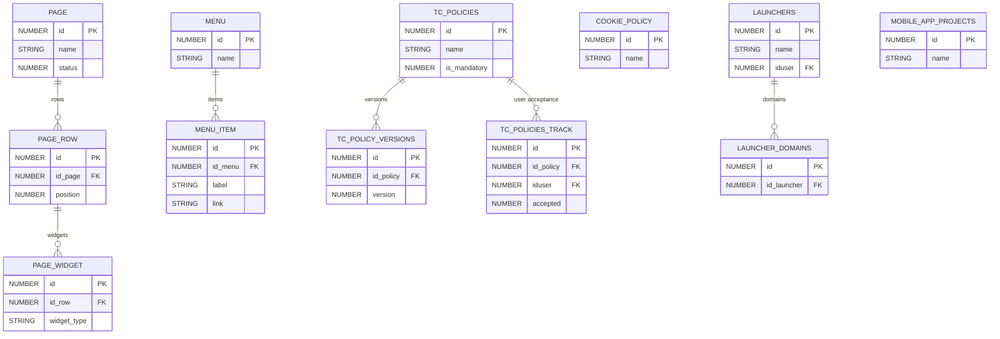

# Platform Configuration

> UI layout (pages, menus), legal policies (cookies, T&C), mobile apps, launchers, proctoring, and other platform infrastructure tables.

This document covers the "plumbing" of the Docebo platform — configuration tables that control the user-facing experience, legal compliance, and infrastructure concerns.

**Domains covered**: Cookie Policy (5), T&C Policies (5), Terms & Conditions (3), Pages (3), Menu (2), Mobile App (3), Launchers (3), Player (1), Presets (2), Proctoring (3), PENS (1), Blacklist (1), Docebo (1)  
**Total tables**: 33 | **Total columns**: ~372 | **Total FKs**: 14

---

## ER Diagram — Key Tables

---

## All Tables

### Cookie Policy (5 tables)

| Table | Cols | FKs | Description |
|-------|------|-----|-------------|
| COOKIE_POLICY | 12 | 0 | Cookie policy definitions |
| COOKIE_POLICY_TRACK | 8 | 1 | User cookie consent tracking |
| CP_COOKIE | 10 | 0 | Individual cookie definitions |
| CP_COOKIE_DESCRIPTION | 12 | 0 | Cookie descriptions/translations |
| CP_POLICY | 14 | 0 | Cookie policy content |

### T&C Policies (5 tables)

| Table | Cols | FKs | Description |
|-------|------|-----|-------------|
| TC_POLICIES | 11 | 0 | Terms & Conditions policy definitions |
| TC_POLICIES_TRACK | 8 | 1 | User T&C acceptance tracking |
| TC_POLICY_VERSIONS | 9 | 1 | Policy version history |
| TC_SUB_POLICIES | 9 | 1 | Sub-policy definitions |
| TC_SUB_POLICIES_TRACK | 8 | 1 | User sub-policy acceptance |

### Terms & Conditions (3 tables)

| Table | Cols | FKs | Description |
|-------|------|-----|-------------|
| TERMS_AND_CONDITIONS | 11 | 0 | Legacy T&C definitions |
| TERMS_AND_CONDITIONS_TRACK | 8 | 1 | Legacy T&C user acceptance |
| TERMS_AND_CONDITIONS_VERSIONS | 8 | 0 | Legacy T&C versions |

### Pages (3 tables)

| Table | Cols | FKs | Description |
|-------|------|-----|-------------|
| PAGE | 14 | 0 | Page layout definitions |
| PAGE_ROW | 11 | 1 | Page row containers |
| PAGE_WIDGET | 15 | 2 | Widget instances in page rows |

### Menu (2 tables)

| Table | Cols | FKs | Description |
|-------|------|-----|-------------|
| MENU | 12 | 0 | Menu definitions |
| MENU_ITEM | 12 | 2 | Menu items/navigation links |

### Mobile App (3 tables)

| Table | Cols | FKs | Description |
|-------|------|-----|-------------|
| MOBILEAPP_MULTIDOMAIN | 27 | 1 | Mobile app multidomain config |
| MOBILE_APP_BUILDS | 20 | 0 | Mobile app build records |
| MOBILE_APP_PROJECTS | 15 | 0 | Mobile app project definitions |

### Launchers (3 tables)

| Table | Cols | FKs | Description |
|-------|------|-----|-------------|
| LAUNCHERS | 9 | 1 | External launcher definitions |
| LAUNCHER_DOMAINS | 7 | 1 | Launcher domain allowlist |
| LAUNCHER_MODULES | 11 | 1 | Launcher module configuration |

### Player (1 table)

| Table | Cols | FKs | Description |
|-------|------|-----|-------------|
| PLAYER_BASEBLOCK | 10 | 1 | LO player base configuration |

### Presets (2 tables)

| Table | Cols | FKs | Description |
|-------|------|-----|-------------|
| PRESET_STATUS | 8 | 0 | Preset status definitions |
| PRESET_VALUES | 9 | 0 | Preset configuration values |

### Proctoring (3 tables)

| Table | Cols | FKs | Description |
|-------|------|-----|-------------|
| PROCTORING_SESSION_RUNTIME | 12 | 0 | Proctoring session runtime data |
| PROCTORING_TEST_RUNTIME | 11 | 0 | Proctoring test runtime data |
| PROCTORING_TOOL_RUNTIME | 10 | 0 | Proctoring tool runtime config |

### PENS (1 table)

| Table | Cols | FKs | Description |
|-------|------|-----|-------------|
| PENS_APPLICATION | 15 | 0 | PENS (Package Exchange Notification) apps |

### Blacklist (1 table)

| Table | Cols | FKs | Description |
|-------|------|-----|-------------|
| BLACKLIST_TAGS | 7 | 0 | Blocked/blacklisted tags |

### Docebo (1 table)

| Table | Cols | FKs | Description |
|-------|------|-----|-------------|
| DOCEBO_ROOM_USER | 11 | 3 | Virtual room user assignments |

---

## Cross-Domain Relationships

| Source Table | FK Column | Target Domain | Target Table |
|-------------|-----------|---------------|-------------|
| TC_POLICIES_TRACK | iduser | [Core Platform](core-platform.md) | CORE_USER |
| COOKIE_POLICY_TRACK | iduser | [Core Platform](core-platform.md) | CORE_USER |
| TERMS_AND_CONDITIONS_TRACK | iduser | [Core Platform](core-platform.md) | CORE_USER |
| MENU_ITEM | id_page | Platform Config | PAGE |
| LAUNCHERS | iduser | [Core Platform](core-platform.md) | CORE_USER |
| MOBILEAPP_MULTIDOMAIN | id_multidomain | [Core Platform](core-platform.md) | CORE_MULTIDOMAIN |
| PLAYER_BASEBLOCK | idcourse | [Learning](learning.md) | LEARNING_COURSE |
| DOCEBO_ROOM_USER | iduser | [Core Platform](core-platform.md) | CORE_USER |

---

[Back to README](README.md)
