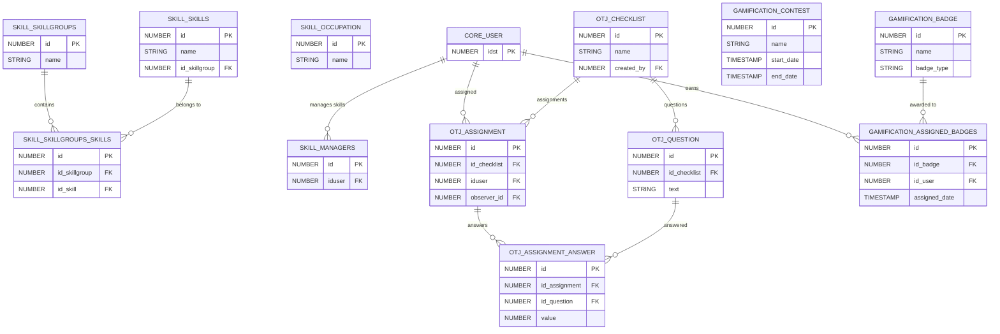

# Skills, On-the-Job & Gamification

> Competency mapping, skill groups, observation checklists (OTJ), badges, contests, leaderboards, and rewards.

This document covers three related domains: Skills (competency management), On-the-Job (observation checklists for field evaluation), and Gamification (badges, contests, and rewards systems).

**Domains covered**: Skills (17), On-the-Job (13), Gamification (21)  
**Total tables**: 51 | **Total columns**: ~494 | **Total FKs**: 44

---

## ER Diagram — Key Tables

---

## All Tables

### Skills (17 tables)

| Table | Cols | FKs | Description |
|-------|------|-----|-------------|
| SKILL_AREAS_OF_IMPROVEMENT | 10 | 2 | Skill gaps identified for users |
| SKILL_AREAS_OF_IMPROVEMENT_LOG | 9 | 1 | History of skill gap changes |
| SKILL_CONTENT_PAGINATION | 6 | 0 | Content pagination for skill views |
| SKILL_CONTENT_SUGGESTIONS | 11 | 1 | Content recommended for skill development |
| SKILL_MANAGERS | 10 | 1 | Skill management assignments |
| SKILL_MANAGERS_REPORT_SETTING | 8 | 1 | Manager report settings |
| SKILL_MANAGERS_REPORT_USER_SETTING | 7 | 1 | Per-user manager report settings |
| SKILL_MANAGER_APPROVAL | 8 | 1 | Manager approval for skill requests |
| SKILL_MANAGER_EVALUATION | 12 | 1 | Manager skill evaluations |
| SKILL_OCCUPATION | 11 | 0 | Job role/occupation definitions |
| SKILL_SKILLGROUPS | 11 | 0 | Skill group definitions |
| SKILL_SKILLGROUPS_BRANCHES | 7 | 1 | Skill groups linked to branches |
| SKILL_SKILLGROUPS_CHANNELS | 7 | 1 | Skill groups linked to Coach & Share channels |
| SKILL_SKILLGROUPS_GROUPS | 7 | 1 | Skill groups linked to user groups |
| SKILL_SKILLGROUPS_SKILLS | 8 | 0 | Skill-to-group mapping |
| SKILL_SKILLS | 15 | 0 | Skill definitions |
| SKILL_SKILLS_OBJECTS | 10 | 1 | Skills linked to learning objects |

### On-the-Job (13 tables)

| Table | Cols | FKs | Description |
|-------|------|-----|-------------|
| OTJ_ASSIGNMENT | 19 | 4 | Observation checklist assignments |
| OTJ_ASSIGNMENT_ANSWER | 10 | 2 | Answers to checklist questions |
| OTJ_ASSIGNMENT_ANSWER_OPTION | 8 | 2 | Selected options per answer |
| OTJ_ASSIGNMENT_APPROVAL | 14 | 4 | Assignment approval workflow |
| OTJ_CHECKLIST | 16 | 2 | Observation checklist definitions |
| OTJ_QUESTION | 13 | 2 | Checklist questions |
| OTJ_QUESTION_GROUP | 9 | 1 | Question groupings |
| OTJ_QUESTION_OPTION | 10 | 2 | Answer options for questions |
| OTJ_SCHEDULE | 13 | 2 | Assignment schedules |
| OTJ_SCHEDULE_BRANCH | 7 | 2 | Schedule-to-branch targeting |
| OTJ_SCHEDULE_GROUP | 7 | 2 | Schedule-to-group targeting |
| OTJ_SCHEDULE_USER | 7 | 2 | Schedule-to-user targeting |
| OTJ_VERSION | 8 | 1 | Checklist versioning |

### Gamification (21 tables)

| Table | Cols | FKs | Description |
|-------|------|-----|-------------|
| GAMIFICATION_ASSIGNED_BADGES | 10 | 0 | User badge awards |
| GAMIFICATION_ASSOCIATED_SETS | 8 | 0 | Associated badge sets |
| GAMIFICATION_BADGE | 12 | 0 | Badge definitions |
| GAMIFICATION_BADGE_SOCIAL_NETWORK | 6 | 0 | Badge social sharing config |
| GAMIFICATION_BADGE_TRANSLATION | 9 | 0 | Badge translations |
| GAMIFICATION_COLLECTION | 10 | 0 | Badge collection definitions |
| GAMIFICATION_COLLECTION_BADGE | 7 | 0 | Badges in collections |
| GAMIFICATION_COLLECTION_TRANSLATION | 8 | 0 | Collection translations |
| GAMIFICATION_CONTEST | 14 | 0 | Contest definitions |
| GAMIFICATION_CONTEST_CHART | 8 | 0 | Contest leaderboard charts |
| GAMIFICATION_CONTEST_REWARD | 8 | 0 | Contest reward assignments |
| GAMIFICATION_CONTEST_TRANSLATION | 8 | 0 | Contest translations |
| GAMIFICATION_LEADERBOARD | 8 | 0 | Leaderboard definitions |
| GAMIFICATION_LEADERBOARD_BADGE | 7 | 0 | Badges on leaderboards |
| GAMIFICATION_LEADERBOARD_TRANSLATION | 7 | 0 | Leaderboard translations |
| GAMIFICATION_REWARD | 9 | 0 | Reward definitions |
| GAMIFICATION_REWARDS_SET | 7 | 0 | Reward sets |
| GAMIFICATION_REWARD_TRANSLATION | 7 | 0 | Reward translations |
| GAMIFICATION_SOCIAL_NETWORK | 7 | 0 | Social network integration |
| GAMIFICATION_USER_REWARDS | 8 | 2 | User reward redemptions |
| GAMIFICATION_USER_WALLET | 7 | 0 | User point wallets |

---

## Cross-Domain Relationships

| Source Table | FK Column | Target Domain | Target Table |
|-------------|-----------|---------------|-------------|
| SKILL_MANAGERS | iduser | [Core Platform](core-platform.md) | CORE_USER |
| SKILL_SKILLGROUPS_CHANNELS | idchannel | [Coach & Share](coach-and-share.md) | APP7020_CHANNELS |
| SKILL_SKILLS_OBJECTS | idobject | [Learning](learning.md) | LEARNING_ORGANIZATION |
| OTJ_ASSIGNMENT | iduser, observer_id | [Core Platform](core-platform.md) | CORE_USER |
| OTJ_ASSIGNMENT | idcourse | [Learning](learning.md) | LEARNING_COURSE |
| OTJ_ASSIGNMENT_APPROVAL | approver_type | [Core Platform](core-platform.md) | MANAGER_TYPE |
| GAMIFICATION_USER_REWARDS | id_user | [Core Platform](core-platform.md) | CORE_USER |

---

[Back to README](README.md)
