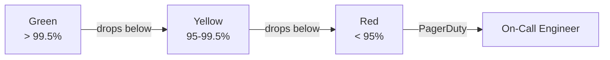

# :material-clipboard-pulse: Operational Reports

## Daily Operational Metrics

| Metric | Definition | SLA |
|--------|-----------|-----|
| P99 Query Latency | 99th percentile query time | < 10s |
| Pipeline Success Rate | Successful tasks / total | > 99.5% |
| Data Freshness | Max lag from source | < 2 hours |
| Storage Growth | Daily delta in TB | < 5 TB/day |
| Failed Logins | Auth failures / total attempts | < 0.1% |

## Self-Service Queries

```sql
-- Pipeline success rate (last 24h)
SELECT
  ROUND(
    COUNT_IF(STATE = 'SUCCEEDED') * 100.0 / COUNT(*), 2
  ) AS success_rate_pct
FROM TABLE(INFORMATION_SCHEMA.TASK_HISTORY(
  SCHEDULED_TIME_RANGE_START => DATEADD('DAY', -1, CURRENT_TIMESTAMP())
));
```

## Alerting Thresholds


