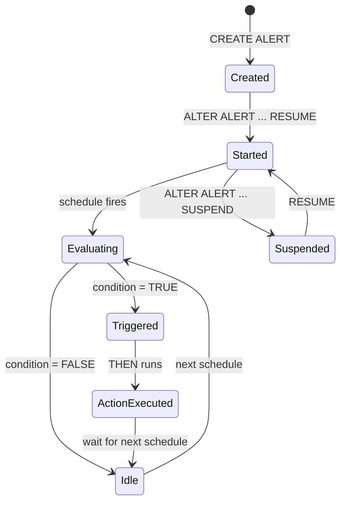

# :material-bell-ring: Configuring Alerts

Step-by-step guide to creating and managing Snowflake alerts.

See also: [Alerts Overview](index.md) | [Alert Runbook](runbook.md)

## Alert Lifecycle



## Template: Data Freshness Alert

```sql
CREATE ALERT freshness_alert
  WAREHOUSE = monitoring_wh
  SCHEDULE = '15 MINUTE'
  IF (EXISTS (
    SELECT 1
    FROM curated.load_metadata
    WHERE last_loaded < DATEADD('hour', -4, CURRENT_TIMESTAMP())
      AND is_critical = TRUE
  ))
  THEN
    CALL SYSTEM$SEND_EMAIL(
      'ops_notifications',
      'data-eng@acme.com',
      'Critical Table Stale',
      'One or more critical tables have not been refreshed in 4+ hours.'
    );

ALTER ALERT freshness_alert RESUME;
```

## Best Practices

- Use dedicated `monitoring_wh` (X-Small) for alert evaluation
- Keep alert conditions lightweight (avoid full table scans)
- Set schedule frequency ≥ 2x your acceptable detection delay
- Combine email alerts with Slack/PagerDuty via webhook procedures
