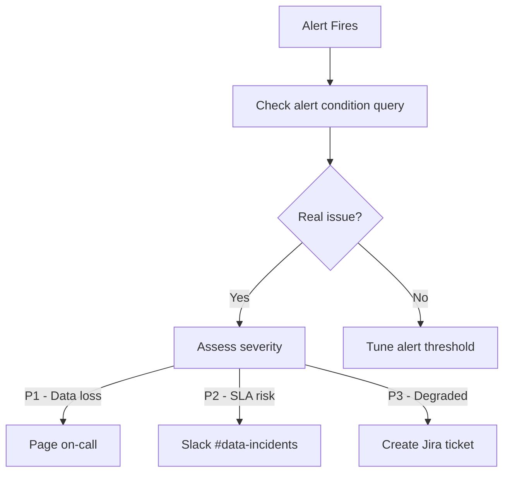

# :material-book-open-page-variant: Alert Runbook

Standard operating procedures when alerts fire.

See also: [Alerts Overview](index.md) | [Configuring Alerts](configuring.md)

## Triage Flow

## Runbook: Pipeline Failure

| Step | Action | Owner |
|------|--------|-------|
| 1 | Check `TASK_HISTORY` for error message | On-call |
| 2 | Identify root cause (upstream? infra? code?) | On-call |
| 3 | If upstream: check source system status | On-call |
| 4 | If code: review recent PR merges | Data Engineer |
| 5 | Retry task manually | Data Engineer |
| 6 | Verify data in downstream tables | Data Engineer |
| 7 | Post incident summary in #data-incidents | On-call |

## Runbook: Credit Spike

| Step | Action | Owner |
|------|--------|-------|
| 1 | Identify warehouse with unusual usage | Platform |
| 2 | Check `QUERY_HISTORY` for expensive queries | Platform |
| 3 | If runaway query: cancel and notify user | Platform |
| 4 | If legitimate spike: acknowledge alert | Platform |
| 5 | If recurring: resize warehouse or optimize SQL | Data Engineer |

## Escalation Matrix

| Severity | Response Time | Channel | Escalation After |
|----------|--------------|---------|-----------------|
| P1 | 5 min | PagerDuty | 15 min → Engineering Lead |
| P2 | 30 min | Slack | 2 hours → Team Lead |
| P3 | Next business day | Jira | 1 week → Sprint Planning |
