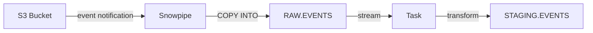

# :material-cloud-download: Ingestion

## Architecture



## Snowpipe Configuration

```sql
CREATE PIPE raw_events_pipe
  AUTO_INGEST = TRUE
  AS COPY INTO raw.events
  FROM @raw_data_stage/events/
  FILE_FORMAT = (TYPE = 'JSON');
```

## Streaming Ingestion

```sql
CREATE STREAM events_stream
  ON TABLE raw.events
  APPEND_ONLY = TRUE;
```

## Related Pages

- [Snowpipe](snowpipe.md) — File-based continuous ingestion
- [Streaming Ingestion](streaming.md) — Sub-second row-level ingestion via SDK

## Data Sources

| Source | Frequency | Format | Volume |
|--------|-----------|--------|--------|
| Web Analytics | Real-time | JSON | ~50M rows/day |
| CRM Export | Hourly | CSV | ~2M rows/hour |
| IoT Sensors | 5-minute | Parquet | ~100M rows/day |
| Payment Gateway | Real-time | JSON | ~5M rows/day |
