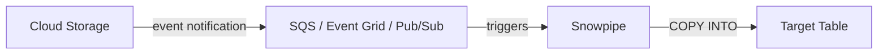

# :material-cloud-download: Snowpipe

Continuous, event-driven data ingestion from external stages.

See also: [Ingestion Overview](index.md) | [Streaming Ingestion](streaming.md)

## Architecture



## Setup Steps

1. Create external stage
2. Create target table
3. Create file format
4. Create pipe with `AUTO_INGEST = TRUE`
5. Configure cloud event notifications

## Example

```sql
CREATE PIPE sales_pipe
  AUTO_INGEST = TRUE
  ERROR_INTEGRATION = pipe_error_integration
  AS COPY INTO raw.sales
  FROM @raw_data_stage/sales/
  FILE_FORMAT = (FORMAT_NAME = 'csv_format')
  ON_ERROR = 'SKIP_FILE';
```

## Monitoring Pipe Status

```sql
SELECT SYSTEM$PIPE_STATUS('sales_pipe');

-- Check load history
SELECT *
FROM TABLE(INFORMATION_SCHEMA.COPY_HISTORY(
  TABLE_NAME => 'raw.sales',
  START_TIME => DATEADD('hour', -24, CURRENT_TIMESTAMP())
))
ORDER BY last_load_time DESC;
```

## Error Handling

| Error Type | Cause | Resolution |
|-----------|-------|------------|
| LOAD_FAILED | Schema mismatch | Fix file format or target DDL |
| PARTIALLY_LOADED | Row-level errors | Check `ON_ERROR` policy |
| QUEUE_PAUSED | Stale SQS notification | Refresh pipe with `ALTER PIPE ... REFRESH` |
