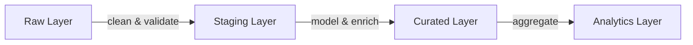

# :material-swap-horizontal: Transformation

## Pipeline Layers



## Related Pages

- [Dynamic Tables](dynamic-tables.md) — Declarative managed transformations
- [Task DAGs](task-dags.md) — Multi-step orchestration with dependencies

## Dynamic Tables

```sql
CREATE DYNAMIC TABLE curated.customers
  TARGET_LAG = '1 hour'
  WAREHOUSE = transform_wh
  AS
  SELECT
    id,
    TRIM(UPPER(email)) AS email,
    first_name || ' ' || last_name AS full_name,
    created_at::DATE AS signup_date
  FROM staging.raw_customers
  WHERE email IS NOT NULL;
```

## Task DAGs

```sql
CREATE TASK transform_orders
  WAREHOUSE = transform_wh
  SCHEDULE = 'USING CRON 0 */2 * * * UTC'
  WHEN SYSTEM$STREAM_HAS_DATA('orders_stream')
  AS CALL sp_transform_orders();
```
