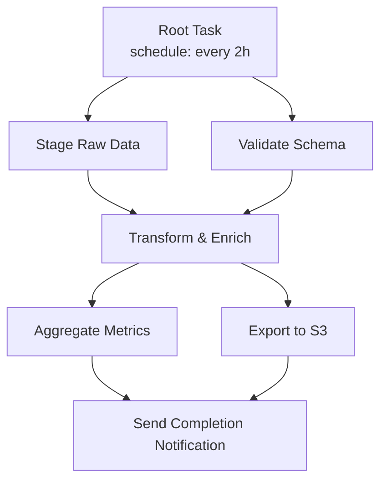

# :material-sitemap: Task DAGs

Orchestrate multi-step pipelines using Snowflake Task graphs.

See also: [Transformation Overview](index.md) | [Dynamic Tables](dynamic-tables.md)

## DAG Structure



## Implementation

```sql
-- Root task (scheduled)
CREATE TASK pipeline_root
  WAREHOUSE = transform_wh
  SCHEDULE = 'USING CRON 0 */2 * * * UTC'
  AS SELECT 1;

-- Child: stage data
CREATE TASK stage_raw_data
  WAREHOUSE = transform_wh
  AFTER pipeline_root
  AS CALL sp_stage_raw_data();

-- Child: validate
CREATE TASK validate_schema
  WAREHOUSE = transform_wh
  AFTER pipeline_root
  AS CALL sp_validate_schema();

-- Grandchild: transform (waits for both parents)
CREATE TASK transform_enrich
  WAREHOUSE = transform_wh
  AFTER stage_raw_data, validate_schema
  AS CALL sp_transform();

-- Resume the DAG
ALTER TASK pipeline_root RESUME;
```

## Error Handling with Finalizer

```sql
CREATE TASK pipeline_finalizer
  WAREHOUSE = transform_wh
  FINALIZE = pipeline_root
  AS
  BEGIN
    LET status := SYSTEM$GET_PREDECESSOR_RETURN_VALUE('transform_enrich');
    IF (status = 'FAILED') THEN
      CALL notify_failure('Pipeline failed at transform step');
    END IF;
  END;
```

## Monitoring

```sql
SELECT
  name,
  state,
  scheduled_time,
  completed_time,
  DATEDIFF('second', scheduled_time, completed_time) AS duration_sec,
  error_message
FROM TABLE(INFORMATION_SCHEMA.TASK_HISTORY())
WHERE root_task_id = (SELECT id FROM TASK WHERE name = 'PIPELINE_ROOT')
ORDER BY scheduled_time DESC;
```
