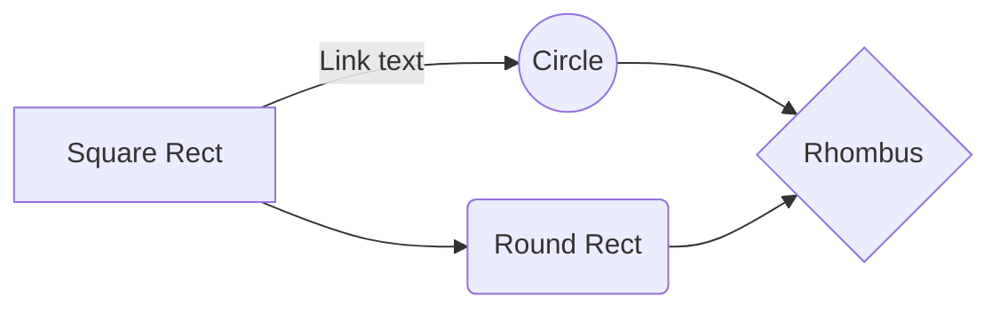

# Getting Started

This guide covers how to add and manage content in Cerebro.

## Adding a New Document

1. Create a new `.md` file under the `docs/` directory
2. Organize files into subdirectories by topic
3. Open a Pull Request with your changes

## Adding Images

Place image files in `docs/assets/` and reference them with relative paths:

```markdown

```

## Markdown Features

Cerebro supports standard markdown plus these extensions:

### Admonitions

!!! note
    Use admonitions to call out important information.

!!! warning
    Warnings highlight potential issues.

### Code Blocks

```python
print("Syntax highlighting is supported")
```

## Folder Structure

Organize documents into logical subdirectories. The site navigation is automatically generated from the folder hierarchy:

```
docs/
├── index.md
├── assets/
│   └── images go here
├── topic-a/
│   ├── index.md
│   └── subtopic.md
└── topic-b/
    └── index.md
```

## Diagrams

