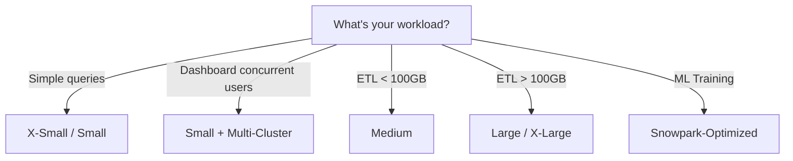

# :material-warehouse: Warehouse Sizing Guide

Detailed guidance for selecting the right warehouse size based on workload characteristics.

See also: [Warehouse Overview](index.md) | [Multi-Cluster Configuration](multi-cluster.md)

## Sizing Decision Tree

## Benchmarks by Workload

| Workload Type | Data Volume | Recommended Size | Avg Query Time |
|---------------|-------------|-----------------|----------------|
| Ad-hoc exploration | < 1 GB | X-Small | 2-5s |
| BI dashboards | 1-50 GB | Small | 5-15s |
| Scheduled ETL | 50-500 GB | Medium | 1-5 min |
| Heavy joins | 500 GB - 2 TB | Large | 5-15 min |
| Full refresh | > 2 TB | X-Large | 15-60 min |

## Cost vs Performance Tradeoffs

Doubling warehouse size generally:

- Doubles cost (credits/hour)
- Halves execution time for scan-heavy queries
- Has diminishing returns for complex joins or small datasets

!!! tip
    Start one size smaller than you think you need. Monitor with `QUERY_HISTORY` and upsize only when p95 latency exceeds your SLA.
