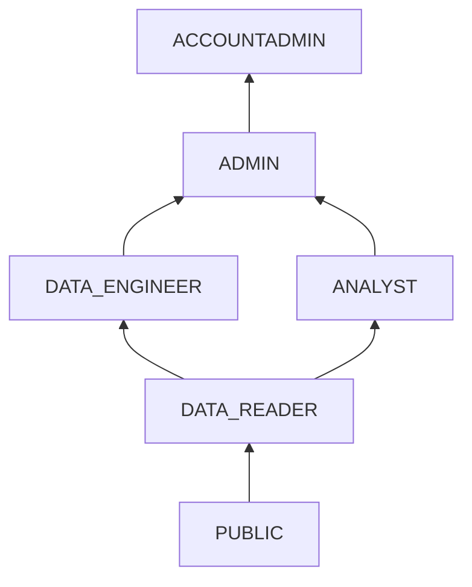

# :material-account-group: Roles

## Role Hierarchy



## Standard Roles

| Role | Purpose | Key Privileges |
|------|---------|----------------|
| DATA_READER | Read-only access | SELECT on curated tables |
| ANALYST | BI and reporting | SELECT + CREATE VIEW |
| DATA_ENGINEER | Build pipelines | CREATE TABLE, TASK, PIPE |
| ADMIN | Full environment mgmt | MANAGE GRANTS, CREATE ROLE |

## Creating Custom Roles

```sql
CREATE ROLE project_lead;
GRANT ROLE data_engineer TO ROLE project_lead;
GRANT USAGE ON WAREHOUSE analytics_wh TO ROLE project_lead;
GRANT USAGE ON DATABASE production TO ROLE project_lead;
```
